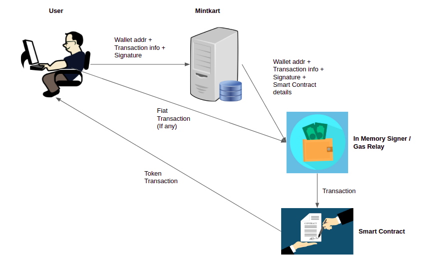

# NFT-Twinning-Smart-Contracts

## Smart Contracts

- Language Used: Smartpy
- Blockchain: Tezos
- Testnet: Jakartanet
- Number of contracts: 2
- Contracts: 
  - MintkartFA2 contract
  - Mintkart contract 
- Contract Addresses:
  - MintkartFA2: KT1ACE6u6tY8owf7oBVnk8w7EouLNiwMALc5
  - Mintkart: KT1AgsSUecHJVwiBxzJo7JYogVwF6ti4bkXR
- Tezos smart contract explorers:
  - MintkartFA2: https://jakarta.tzstats.com/KT1ACE6u6tY8owf7oBVnk8w7EouLNiwMALc5
  - Mintkart: https://jakarta.tzstats.com/KT1AgsSUecHJVwiBxzJo7JYogVwF6ti4bkXR
- MintkartFA2 Contract
  - Storage: 
    - administrator: Address of the main admin of the smart contract
    - sellers: List of all seller addresses in the Mintkart portal
    - customer_service: List of all customer service addresses in the Mintkart portal
    - all_tokens: List of all token IDs minted
    - ledger: Maintains a map between address + tokenID to balance i.e. {address, tokenId} : balance (i.e. balance of a address for a given tokenId)
    - metadata: Metadata of the smart contract
    - paused: If true, then smart contracts won't be executing any functions if calls are made
    - token_metadata: Maintains a map between tokenId and its metadata, i.e. tokenID : {warranty, artifactUri, name, symbol etc}
  - Entry points:
    - mint: 
       - Params: [tokenId, metadata, itemId, warranty, mintkart_address]
       - Given the tokenID, and the metadata of the token, the entry point mints the token to the caller's address.
    - single_transfer:
        - Params: [from_, tokenId, to_]
        - Given the tokenID to be transferred, and the address to which the token need to be transferred to, this entry point transfers the token. It is transferred from the from_ address field.
    - init_replace_item:
       - Params: [tokenId, oldItemId, newItemId, mintkart_address]
       - It is used as the initializer for initializing the replacement of an item. It takes the old serial number and the tokenId, and updates it with the new serial number.
    - init_burn:
      - Params: [tokenId, mintkart_address]
      - It is used as the initializer for initializing the burn of an item. It takes the tokenId and burn it if its warranty has expired.
    - add_seller:
      - Params: [seller]
      - Used to whitelist the given seller address
    - add_customer_service
      - Params: [customer_service]
      - Used to whitelist the given customer service address

- Mintkart Contract
  - Storage:
    - fa2_contract_address: Address of FA2 contract
    - metadata : Metadata of the contract
    - warranties: Maintains a map between tokenID and warranty, its collection type, claimedOn date and burntOn date
    - replacements: Maintains a map between tokenID and its replacements history
    - twins: Maintains a map between serial number of an item and its NFT ID
    - rewards: Maintains a map between a user address and his/her collections claimed
  - Entry points:
    - set_fa2_contract_addr:
        - Params: [address]
        - Setter function, which sets the fa2 contract associated with the current marketplace contract
     - create_twin: 
        - Params: [itemId, tokenId, seller, warranty]
        - This entry point can only be called by the MintkartFA2 contract. Given a serial number of an item, this creates a twin NFT on-chain.
    - buy:
      - Params: [itemId, buyer]
      - This entry point can only be called by the admin address (central server). Given the serial number, this transfers the specified to the ‘buyer’ address field.
    - replace_item:
      - Params: [tokenId, oldItemId, newItemId]
      - This entry point can only be called by the MintkartFA2 contract. This updates the item replacement history.
    - burn:
      - Params: [tokenId]
      - This entry point can only be called by the MintkartFA2 contract. Given a tokenID, this completely decays the particular NFT.

## Gamification

For every NFT that is minted on-chain, we are assigning it to a collection based upon its various metadata variables. These can be either of the following:
#### Diamond Class

#### Gold Class

#### Silver Class

#### Bronze Class

After the user collects certain of these by certain amounts, he/she can claim special discount coupons.
